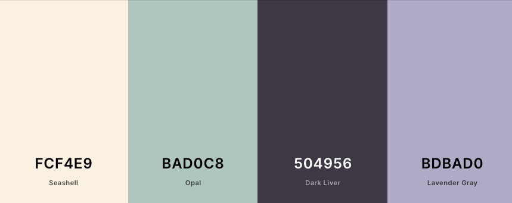

# Strike a Paws!

This aim of this project is to create a website for Regina's pet photography business - Strike a Paws!. The website will provide potential customers a platform to view Regina's work, purchase her work and contact for a consultation/booking.

## <ins>Contents </ins>
1. UX
    * Project Goals
    * Customer Goals
    * Business Owner Goals
    * Developer Goals
    * User Stories
    * Design Choices
    * Wireframes
      
2. Features
3. Technologies used
4. Testing
5. Deployment
6. Credits
    * Content

## 1. UX

### Project Goals

The main aim for this website is to provide a platform for Regina to showcase her work and provide a place where potential customers can find all the information they might need including how to book a photoshoot of their pets.

### Customer Goals

The target audience for this project are pet owners.

Customer's goals are:

- to see Regina's portfolio.
- to see other customer's reviews.
- to contact Regina for a consultation or photoshoot.
- to see the services offered.
- to learn more about the photographer.

### Business Owner Goals

- to showcase her work in an elegant way.
- to drum up new business.
- to have a site to point potential customers to.
- increase photoshoot bookings.

### Developer Goals

- To create a beautiful, elegant website that provides great user experience for customers.
- to have a responsive website that works well on various mediums.

### User Stories

As a customer I want:

- to be able to see various photos so that I know how mine can turn out.
- to be able to navigate with ease through pages.
- to see the prices so I can see if the service is affordable.
- an easy way to contact the photographer.
- to see other people's experiences and reviews.

### Design Choices

* Colour Scheme

I chose this colour scheme because I wanted the photos to be the main attraction and this soft colour scheme helps with that. 
The seashell colour was used for the background of all pages as well as the white colour of text.
The dark liver colour was used instead of a black, so that the font was a little softer and fit in with the theme. It was also used as a shadow because it provided a softer shadow than black.
All three colours were used to highlight important parts and to bring all pages together with the colour scheme.

* Images

The images used were all sourced from Pexels.com. Since it's a photography website the images were what made the website. That's why I chose the most outstanding photos for the hero images as well as the gallery.

### Wireframes

- [Home](./wireframes/home.png)
- [Gallery](./wireframes/gallery.png)
- [Services](./wireframes/services.png)
- [Contact](./wireframes/contact.png)

while the initial plan for the website was to have only a hero image in the landing page, it was decided to create a hero image for each page, to show off more of Regina's photography as well as to keep all pages consistent.

## 2. Features

* Navigation 

This allows the user to navigate through different pages.

* Paw Icon

This gives the user an easy access to the home page without having to use the navigation bar.

* Services section

This allows the user to see the packages on offer.

* Contact page

This allows customers to get in contact with Regina.

* Features to implement in the future

The selling of both Regina's prints as well as her packages with a click of a button.

## 3. Technologies used

* Languages
    
    * HTML5
    * CSS3 

* Frameworks and libraries

    * Bootstrap4
    * Font Awesome icons
    * Google fonts

* Workspace and version control

    * Github
    * Gitpod

* Wireframes

    * Balsamiq
   
    
## 4. Testing
## 5. Deployment
## 6. Credits
 
### Content

* All images have been sourced from pexels.com

* Font used is Raleway from google fonts.

* Fontawesome.com for paw and menu icons.

* Htmlcolorcodes.com and coolors.co to pick colour scheme.

* copied last review comment from this site https://eatsleepwander.com/photographer-review-examples/2/

### Code

* General

    * Bootstrap website for general aid with bootstrap framework.
    * W3Schools 
    * CSS tricks

* Specific code 

    * Bootstrap to create collapsable menu
    * https://www.w3schools.com/howto/howto_css_image_grid_responsive.asp to create the gallery
    * https://forum.freecodecamp.org/t/why-is-my-navbar-behind-other-content/62059 to have the header be on top in all sections.
    * https://www.w3schools.com/howto/howto_css_image_text.asp to align text on images.

