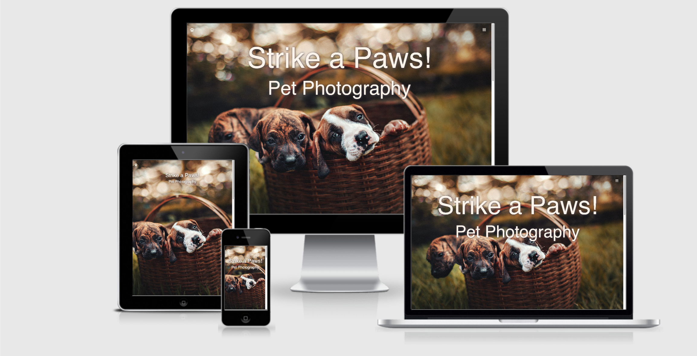
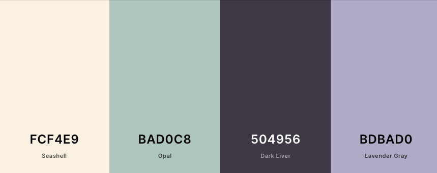

# Strike a Paws!

This aim of this project is to create a website for Regina's pet photography business - Strike a Paws!. The website will provide potential customers a platform to view Regina's work, see the services she offers and contact for a consultation/booking.

You can find a link to the live website [here](https://shyanm.github.io/Strike_A_Paws/).

## <ins> Contents </ins>
1. UX
    * Project Goals
    * Customer Goals
    * Business Owner Goals
    * Developer Goals
    * User Stories
    * Design Choices
    * Wireframes
      
2. Features
3. Technologies used
4. Testing
5. Deployment
6. Credits
    * Content
    * Code

## 1. UX

### Project Goals

The main aim for this website is to provide a platform for Regina to showcase her work and provide a place where potential customers can find all the information they might need including how to book a photoshoot of their pets.

### Customer Goals

The target audience for this project are pet owners.

Customer's goals are:

- to see Regina's portfolio.
- to see other customer's reviews.
- to contact Regina for a consultation or photoshoot.
- to see the services offered.
- to learn more about the photographer.

### Business Owner Goals

- to showcase her work in an elegant way.
- to drum up new business.
- to have a site to point potential customers to.
- increase photoshoot bookings.

### Developer Goals

- To create a beautiful, elegant website that provides great user experience for customers.
- to have a responsive website that works well on various mediums.

### User Stories

As a customer I want:

- to be able to see various photos so that I know how mine can turn out.
- to be able to navigate with ease through pages.
- to see the prices so I can see if the service is affordable.
- an easy way to contact the photographer.
- to see other people's experiences and reviews.

### Design Choices

* Colour Scheme

I chose this colour scheme because I wanted the photos to be the main attraction and this soft colour scheme helps with that. 
The seashell colour was used for the background of all pages as well as the white colour of text.
The dark liver colour was used instead of a black, so that the font was a little softer and fit in with the theme. It was also used as a shadow because it provided a softer shadow than black.
All three colours were used to highlight important parts and to bring all pages together with the colour scheme.

* Images

The images used were all sourced from Pexels.com. Since it's a photography website the images were what made the website. That's why I chose the most outstanding photos for the hero images as well as the gallery.

### Wireframes

- [Home](./wireframes/home.png)
- [Gallery](./wireframes/gallery.png)
- [Services](./wireframes/services.png)
- [Contact](./wireframes/contact.png)

while the initial plan for the website was to have only a hero image in the landing page, it was decided to create a hero image for each page, to show off more of Regina's photography as well as to keep all pages consistent.

The services and contact page were also updated quite a bit, as based on the original plan, they seemed too plain compared to the rest. This is why I added a background image to both. Changed the names of the packages to something a bit more fun and added a pop of colour.

## 2. Features

The website has 4 pages that users can reach easily. It also has a fifth page that only shows up once people submit their details in the contact page.

* General Features

    * Navigation 

        This allows the user to navigate through different pages.

    * Paw Icon

        This gives the user an easy access to the home page without having to use the navigation bar.

* Home page
    
    * About me section
        
        This section welcomes the user to the page and introduces them to Regina.

    * Reviews

        This section allows the readers to see other people's experience.

* Gallery page

     This page shows a portfolio of Regina's work and has a small zoom in effect to make the page more dynamic.

* Services page

    This allows the user to see the packages on offer. It also has a button for the customer to enquire which takes the customer to the contact page.

* Contact page

    This allows customers to get in contact with Regina. Once the details are added and a submit button is used, the page takes the customer to a new page with a thank you message.

* Features to implement in the future

    The selling of Regina's prints with a click of a button.

    The ability to click and submit an enquiry based on the particular service the customer chose.

## 3. Technologies used

* Languages
    
    * HTML5
    * CSS3 

* Frameworks and libraries

    * Bootstrap4
    * Font Awesome icons
    * Google fonts

* Workspace and version control

    * Github
    * Gitpod

* Wireframes

    * Balsamiq
   
    
## 4. [Testing](./TESTING.md)

## 5. Deployment

To deploy the Github pages, I did the following steps:

 * I used the Code Institute [template](https://github.com/Code-Institute-Org/gitpod-full-template) as a base for my project.
 * To do that I clicked on the new repository button.
 * Chose the Code Institute as a template.
 * Named it Strike_A_Paws.
 * Under the repository name, I clicked settings.
 * Then in settings I went to the Github Pages and changed the none drop down menu to main.
 * I then clicked save and the website was deployed.

 To run my code locally you need to EITHER :
* Go to the main page of the repository.
* Above the list there is a button with a downward arrow and code on it.

Then you  either :

* You can then chose between https, ssh key or github cli, and for all you click the little copy icon.
* Then you can open the terminal, type git clone and paste the url you copied and press enter.

or:

* click on open with Github Desktop and click choose.
* Find the local path you want to clone to and click clone.

## 6. Credits
 
### Content

* All images have been sourced from pexels.com

* Font used is Raleway from google fonts.

* Fontawesome.com for paw and menu icons.

* Htmlcolorcodes.com and coolors.co to pick colour scheme.

* copied last review comment from this [here](https://eatsleepwander.com/photographer-review-examples/2/).

* <a target="_blank" href="https://icons8.com/icons/set/cat-footprint">Cat Footprint favicon</a> icon by <a target="_blank" href="https://icons8.com">Icons8</a>

### Code

* General

    * [Bootstrap](https://getbootstrap.com)
    * [W3Schools](https://www.w3schools.com) 
    * [CSS tricks](https://css-tricks.com)
    * [Free Code Camp](https://www.freecodecamp.org)

* Specific code 

    * [Bootstrap Collapsable Menu](https://getbootstrap.com/docs/4.0/components/navbar/)
    * [To create a responsive grid for the gallery](https://www.w3schools.com/howto/howto_css_image_grid_responsive.asp) 
    * [to have the header be on top in all sections](https://forum.freecodecamp.org/t/why-is-my-navbar-behind-other-content/62059)
    * [To align text on images](https://www.w3schools.com/howto/howto_css_image_text.asp) 
    * [Parallax effect](https://www.w3schools.com/howto/howto_css_parallax.asp)
    * [Hover and zoom effect on images](https://www.w3schools.com/howto/howto_css_zoom_hover.asp)
    * [Media Queries](https://www.w3schools.com/css/css_rwd_mediaqueries.asp)
    * [Form with the help of bootstrap as well as code insititute tutors](https://getbootstrap.com/docs/4.0/components/forms/)

