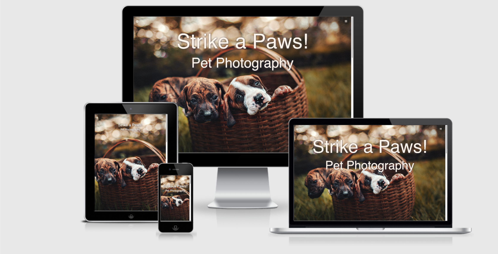
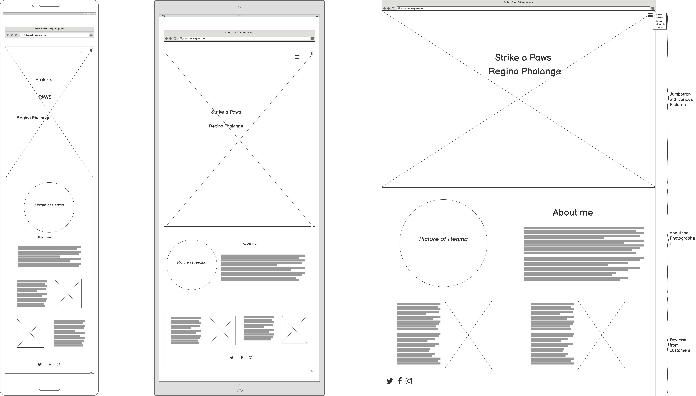
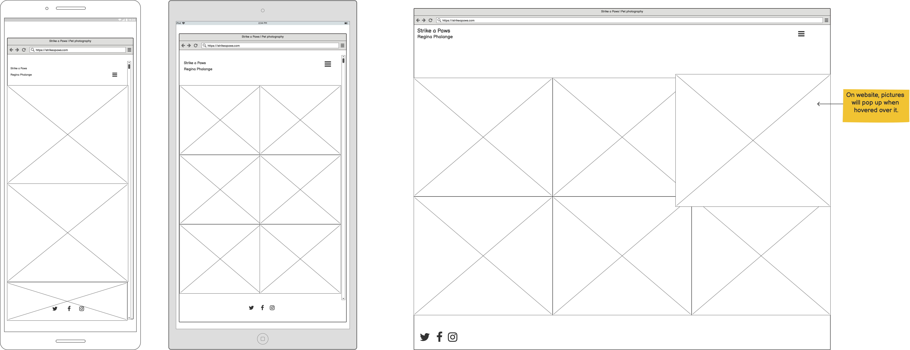
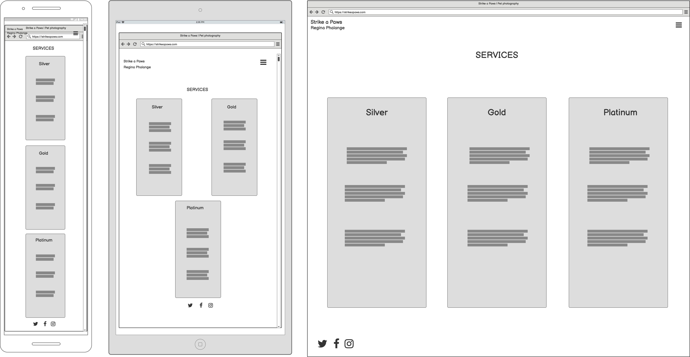
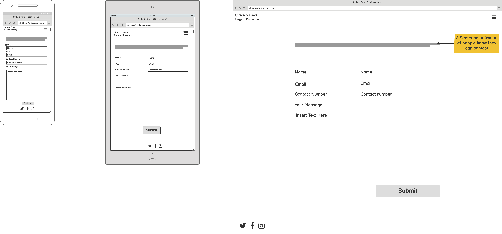

# Strike a Paws!

This aim of this project is to create a website for Regina's pet photography business - Strike a Paws!. The website will provide potential customers a platform to view Regina's work, purchase her work and contact for a consultation/booking.

## <ins>Contents </ins>
1. UX
    * Project Goals
    * Customer Goals
    * Business Owner Goals
    * Developer Goals
    * User Stories
    * Design Choices
    * Wireframes
      
2. Features
3. Technologies used
4. Testing
5. Deployment
6. Credits
    * Content

## 1. UX

### Project Goals

The main aim for this website is to provide a platform for Regina to showcase her work and provide a place where potential customers can find all the information they might need including how to book a photoshoot of their pets.

### Customer Goals

The target audience for this project are pet owners.

Customer's goals are:

- to see Regina's portfolio.
- to see other customer's reviews.
- to be able to purchase her photography.
- to contact Regina for a consultation or photoshoot.
- to see the services offered.
- to learn more about the photographer.

### Business Owner Goals

- to showcase her work in an elegant way.
- to drum up new business.
- to have a site to point potential customers to.
- increase photoshoot bookings.
- Increase sales of product.

### Developer Goals

- To create a beautiful, elegant website that provides great user experience for customers.
- to have a responsive website that works well on various mediums.

### User Stories

As a customer I want:

- to be able to see various photos so that I know how mine can turn out.
- to be able to purchase a photograph I like.
- to be able to navigate with ease through pages.
- to see the prices so I can see if the service is affordable.
- an easy way to contact the photographer.
- to see other people's experiences and reviews.

### Design Choices

The main aim for the design is to give a platform for Regina's work to shine. This is why I used a minimalistic approach with design where the photos are the first thing to catch the eyes. I used 

### Wireframes

- Home

- Gallery

- Services

- Contact

## 2. Features
## 3. Technologies used

- HTML5
    - The project uses HTML5 as a basis of the website.

- CSS4
    - This project uses CSS4 to beautify the website.

- Bootstrap
    - This project uses Bootstrap 
    
## 4. Testing
## 5. Deployment
## 6. Credits
 
### Content
Name and picture of photographer are taken from the tv show Friends.

Images of pets have been sourced from pexels.com

Fonts used are Kalam for Main titles and Raleway for the rest of the text. Both fonts are from google fonts.

Use of bootstrap and font awesome.

used https://maxpelic.com/blog/post/css-only-menu/ to create the menu and adjusted it to my needs.

Debugging - website wasn't showing up in full when viewing in mobile. Adding a user-scalable=0 and maximum scale=1 helped fix that.

The regina photo not sizing down with rest of website.
