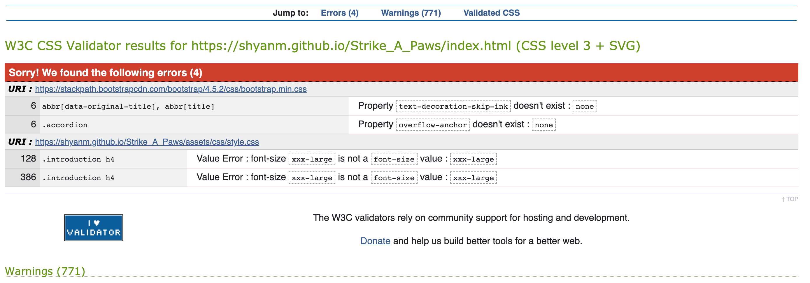
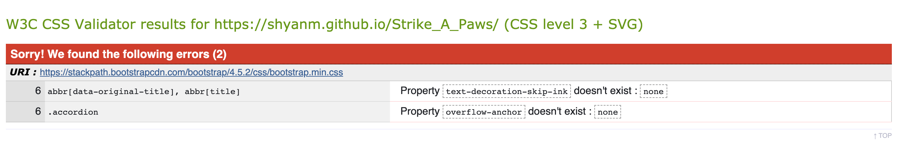
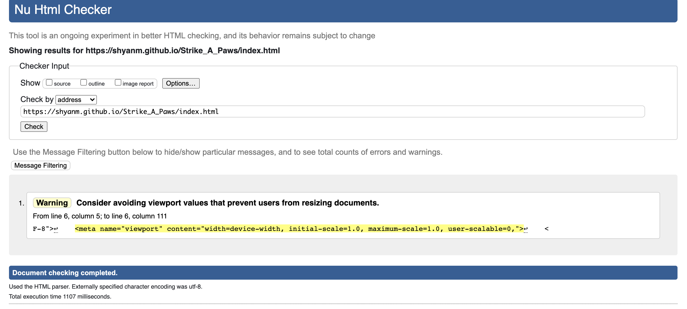
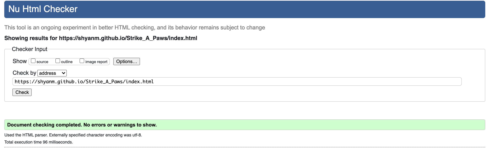
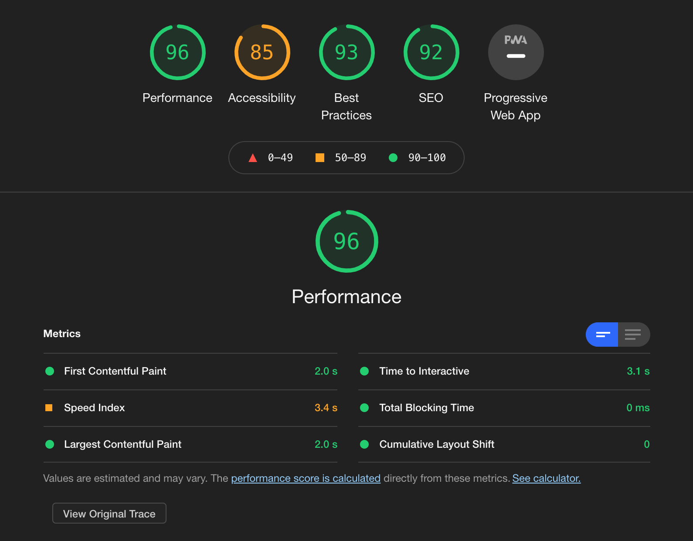
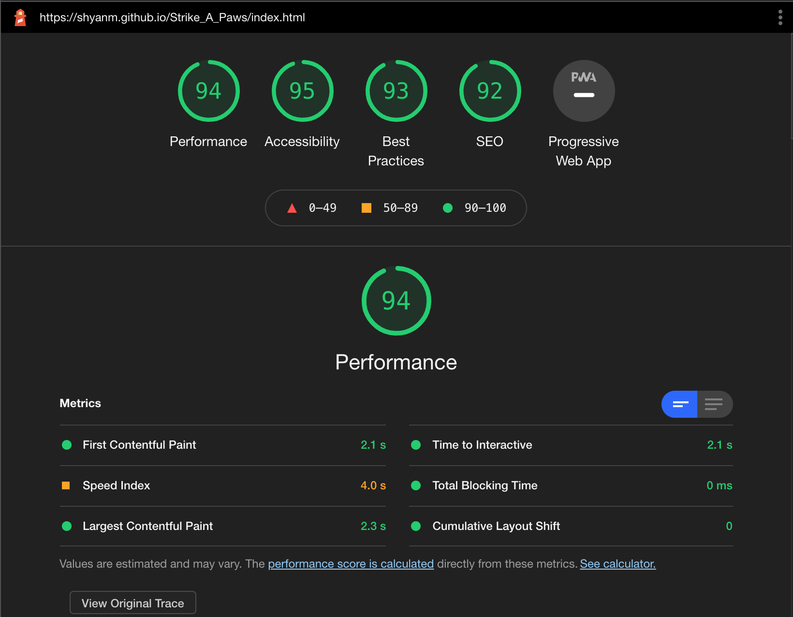

# Testing

[Main Readme.md](./README.md)

## User Stories

As a customer I want to be able to see various photos so that I know how mine can turn out.

1. When a customer clicks on the link to the website they go on the landing page.
2. Top right is a hamburger menu, when clicked on it opens up and has 4 page option.
3. The customer can click on the Gallery option which will take them to the Gallery page.
4. Here they will see a mixture of pictures of pets from previous photoshoots.
5. If visiting on a large screen, the pictures zoom out to create a more dynamic web page.

As a customer I want to be able to navigate with ease through pages.

1. As a customer you have a collapsed menu on the top right, on all pages that is not sticky so you don't need to go back to top of the page to find it.
2. Top left, customers can find a paw icon which when clicked takes them back to the homepage.

As a customer I want to see the prices so I can see if the service is affordable.

1. The customer can find the prices by clicking on the menu and then clicking services.
2. In the services page they can find the three packages with a link each that takes them to the contact page to enquire about the packages.

As a customer I want an easy way to contact the photographer.

1. The customer can contact the photographer by going to the menu and clicking contact.
2. On the contact page the customer can find a form where they can add their details and their message and submit it.
3. The customer can also be led to the contact page from the services page, where there's a contact link in the initial paragraph as well as an enquire button on each package card.

As a customer I want to see other people's experiences and reviews.

1. Customers can find people's reviews on the home page at the bottom after being introduced to Regina.

## Validation testing

### [W3C CSS Validation Service](https://jigsaw.w3.org/css-validator/)

The CSS shows that xxx-large font value isn't always recognised, this was also proved because when viewing on safari website, the font is not enlarged. I changed the font sizes to pixels and this was resolved. The other error is due to the bootstrap framework so I am not able to fix it.

### [W3C Markup Validation Service](https://validator.w3.org/)

Index page was checked in the validator and showed the below.

While it looked very decent I wanted to increase the accessibility as that was also something that showed up when checked with lighthouse chrome dev tools.

I realised that I needed to remove the maximum scale in the meta as well as the user-scalable to make it more accessibile.

This resulted in an improvement in the accessiblity.

The rest of the pages were also run through the validator and the results are linked below.

* [Gallery](./readme_images/w3-gallery.png)
* [Services](./readme_images/w3-services.png)
* [Contact](./readme_images/w3-contact.png)

### Lighthouse

As mentioned above, an accessibility issue came up which was then resolved.

The rest of the pages were also checked via lighthouse and the results are linked below.

* [Gallery](./readme_images/lh-gallery.png)
* [Services](./readme_images/lh-services.png)
* [Contact](./readme_images/lh-contact.png)

## Manual Testing

### General

* Images are responsive both on web and phone.
* Website tested on Chrome and Safari.
* Parallax effect works well for both browsers and then is switched off for smaller devices due to some incompatibilities.

### Home page

* All links in the nav bar work and take you to the defined pages.
* Paw icon refreshes the page since it takes you back to home page.

### Gallery page

* All links in the nav bar work and take you to the defined pages.
* Paw icon takes you back to home page.
* Hover works for all images.
* Realised hover was switched on for mobile and ipad devices as well so switched them off since no mouse is present when using those devices.

### Services page

* All links in the nav bar work and take you to the defined pages.
* Paw icon takes you back to home page.
* All links to the contact page work and are opened in a new page.

### Contact page

* All links in the nav bar work and take you to the defined pages.
* Paw icon takes you back to home page.
* Trying to submit an item without filling out the required details doesn't work.
* Once submitted it changes to the thank you page.

### Thank you page

* Thank you page is a static image with the words thank you. 
* It has both menu and paw so that customer can go back to the website.

## Bugs

1. The hero images weren't scaling down on all devices. While it worked on an android phone it didn't work on 2 iphones. 

    * Fix: I realised that the parallax effect does not work on all phone devices so I switched the background-fixed to background scroll for smaller devices.

2. I initially used a modal so that when a customer presses submit in the contact page, a pop up comes up saying thank you. However the modal was ignoring the required inputs and it seemed like the button was working on its own.

    * While not a proper fix I found a workaround. To fix the issue I need to know javascript which I don't as of yet. However I found that if I add an action and the link to the thank you page, it gives me a similar result.

